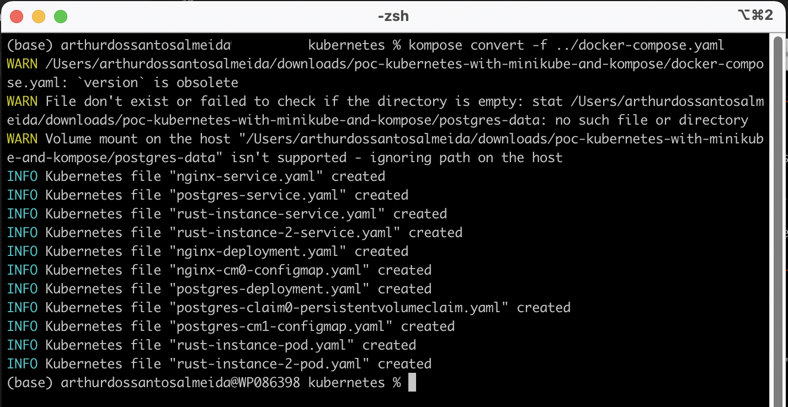
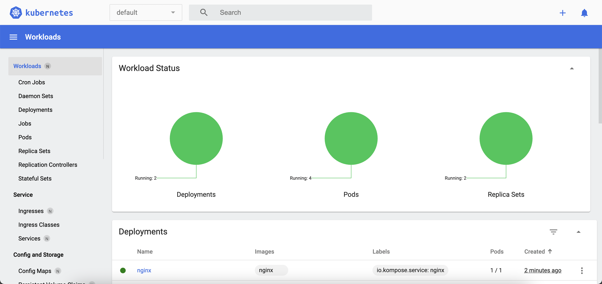

## Como converter seu docker-compose.yaml em Kubernetes files com Kompose e deployar no Kubernetes localmente com Minikube

Instale o Minikube e Kompose:
- https://kompose.io/
- https://minikube.sigs.k8s.io/docs/start/

    
    

### Starte o Minikube:
    
    minikube start

### Converte o compose em arquivos Kubernetes e joga esses arquivos em um diretório chamado 'kubernetes':

    kompose convert -f docker-compose.yaml

### Deploy desses arquivos Kubernetes no Minikube:

    kubectl apply -f .

### Para ver os Pods via terminal:
    
    kubectl get po

### Para acessar o Dashboard do Minikube:

    minikube dashboard

