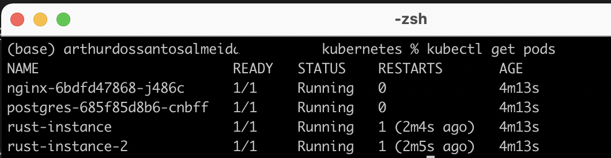

## Como converter seu docker-compose.yaml em Kubernetes files com Kompose e deployar no Kubernetes localmente com Minikube


Instale o Minikube e Kompose:
- https://kompose.io/
- https://minikube.sigs.k8s.io/docs/start/

<p>
    
    
</p>

### Starte o Minikube:
    
    minikube start

### Converte o compose em arquivos Kubernetes:

    kompose convert -f docker-compose.yaml


### Deploy desses arquivos Kubernetes no Minikube:

    kubectl apply -f .


### Para ver os Pods via terminal:
    
    kubectl get pods



### Para acessar o Dashboard do Minikube:

    minikube dashboard


## Outros Comandos Minikube

- **Iniciar o Minikube com o CNI Calico:**

    ```bash
    minikube start --cni=calico
    ```

- **Executar um pod temporário com a imagem `hello-world`:**

    ```bash
    kubectl run --rm --stdin --image=hello-world --restart=Never --request-timeout=30 test-pod
    ```

- **Adicionar um nó no cluster do Minikube:**

    ```bash
    minikube node add
    ```

Você pode executar este comando quantas vezes quiser para adicionar novos nós ao cluster.

- **Deletar o cluster Minikube:**

    ```bash
    minikube delete
    ```
